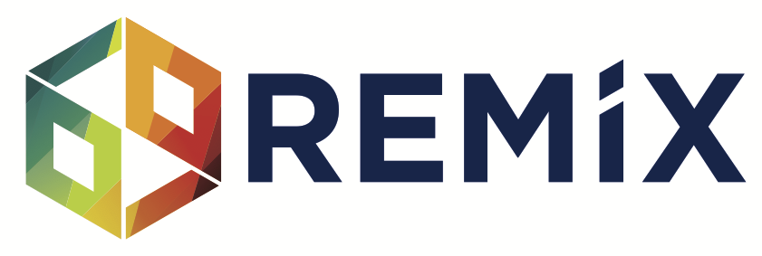
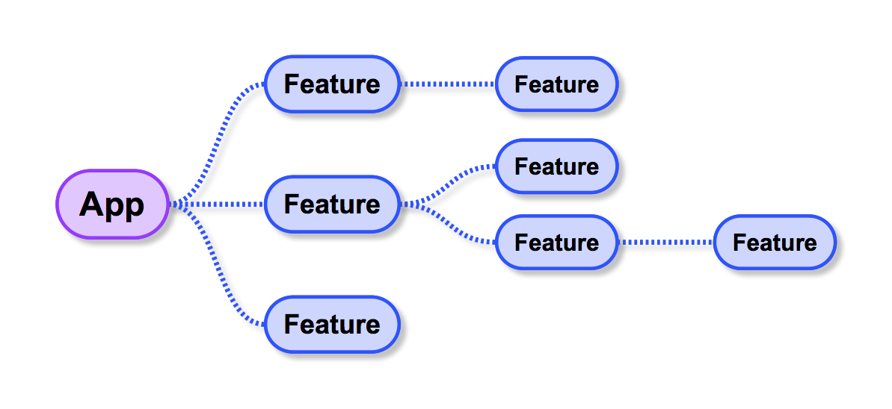
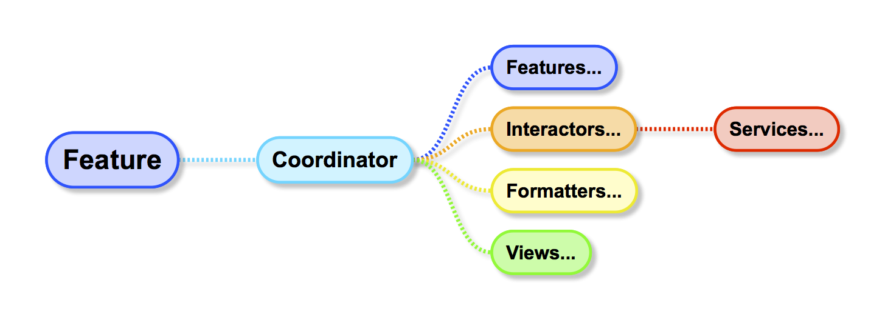
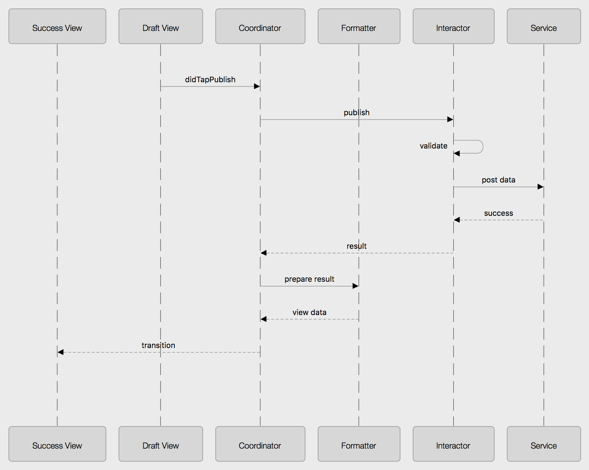
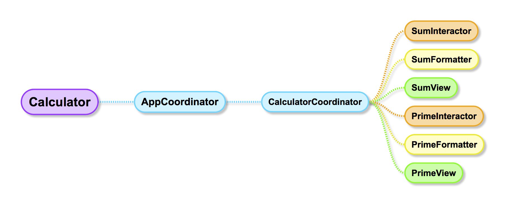
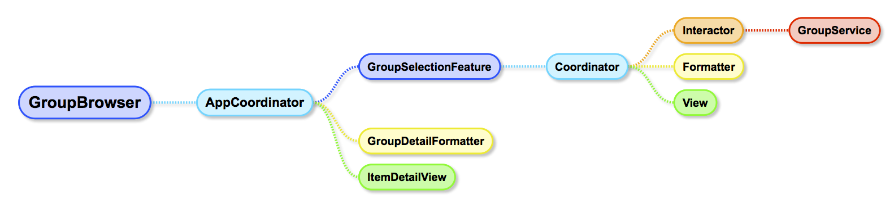
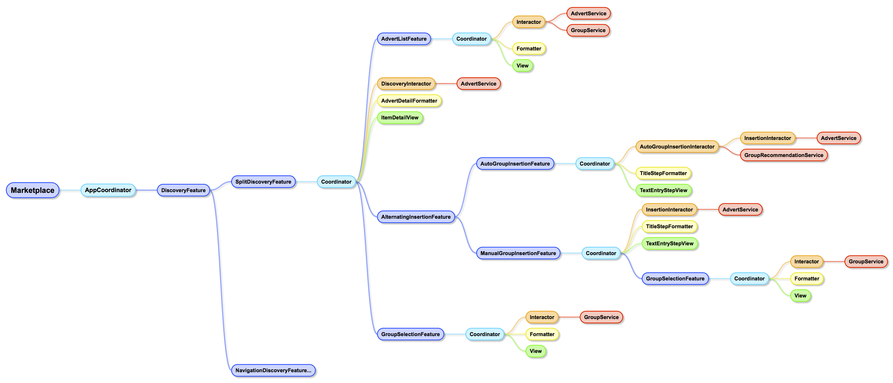

This is the main page for the Remix iOS architecture and in-depth example apps.

See the [RemixBytes](https://github.com/dcutting/RemixBytes) repo for the sample project that accompanies the [iOSCon Bytes talk](https://skillsmatter.com/meetups/9135-ioscon-bytes-with-dan-cutting).

**Note: These examples require Xcode 9 and Swift 4.**

## Motivation

* Many apps with similar features
* A/B feature experiments
* Customised flows & features
* Multiple target platforms

## Primary goals

* Compositional reuse of views, business logic, presentation logic, and feature flows
* Predictable behaviour with many loosely coordinated developers
* Fast, stable automated testing for almost everything

## Guiding principles

* Self-contained components that don't know how they're used (for remixability and predictability)
* Things that need to change together are in one place (for predictability)
* Protocols and dependency injection (for testability)
* Simple, regular, and explicit (no magic!)
* [SOLID](https://en.wikipedia.org/wiki/SOLID_(object-oriented_design))
* Remix is just a collection of design patterns so you don't have to install any frameworks or libraries (although there are some helpful utilities you can use to make some things easier)

## Elements of Remix

The core of Remix is an evolution of the [Coordinator pattern](http://khanlou.com/2015/10/coordinators-redux/) and [Clean Architecture](https://8thlight.com/blog/uncle-bob/2012/08/13/the-clean-architecture.html).

Remix defines a regular hierarchical pattern for building progressively more complex apps. This hierarchy is built around **features**.

The feature hierarchy lays out how the app flows for the user.

Each feature bundles up some other elements with distinct responsibilities. These elements generally talk to each other using the familiar delegate and completion block patterns.

### Coordinator

* The heart of a feature, completely describing its flow logic
* Mediator of all the other elements within a feature; all messages flow through the coordinator
* Handles events from all of its views and transitions between them
* Uses interactors to decide when and how to do this
* Can also use other features to do part of its job, which is how the hierarchy of features is formed
* Exactly one coordinator per feature

### Interactor

* Encapsulates business logic and use cases
* May use services or other interactors to do its job
* Possibly many interactors per feature
* E.g., form validation rules

### Service

* Gateway to external systems such as web services and databases
* May use other services to provide layered functionality like caching
* Possibly many services per interactor
* E.g., connect to a web service to fetch a list of articles

### Formatter

* Presentation logic
* Prepares results from interactors for views
* Possibly many formatters per feature
* E.g., converts form validation errors from an interactor into localised text for a view

### View

* Simple elements that take data prepared by a formatter and put it directly onto the screen
* Passes user actions directly to the coordinators for handling
* Knows nothing about other views or navigation
* Typically implemented as `UIViewControllers`, but declared as protocols for use by the coordinators
* Possibly many views per feature
* E.g., a loading view, a list view, and an error view for an article listing feature

### Feature

* A feature is really a [factory](https://en.wikipedia.org/wiki/Factory_(object-oriented_programming)) for making a coordinator wired up to all of the views, interactors, formatters and other features that it needs to implement a coherent piece of functionality

### Other Remix elements

* ViewData
	- Simple struct owned by a view, representing the state of that view
* Entity
	- Model objects and application-independent business logic
* Factory
	- Abstracts and defers creation of objects
* Wireframe
	- Abstracts system view controllers
	- E.g., `NavigationWireframe` abstracts `UINavigationController`, and `SplitWireframe` abstracts `UISplitViewController`
* Component
	- An element used in multiple ways
	- E.g., a view, interactor, or feature that can be used by several coordinators
* "UI"-prefix denotes a UIKit-specific implementation of an element

## Control flow

This example shows how an action by the user flows through the various elements.

Consider a blogging app that lets a user draft a blog post and publish it to their web site:

* The user begins by tapping the publish button on the Draft View
* The coordinator receives the event and asks the interactor to publish the draft
* The interactor uses a service to publish the draft, then responds to the coordinator with a successful result
* The coordinator asks the formatter to turn that result into a friendly string for the user
* The coordinator knows this was a successful result, so transitions to the success view

## Benefits of this structure

Most elements are independent and just have inputs and outputs that can be used by anybody.

For instance, views have no dependencies on any other elements. They know nothing of interactors, services, formatters, or other views. They don't even know about coordinators directly; they just use the delegate pattern to pass off every action they receive from the user to a coordinator.
 
Views will display any formatted data you give them. They don't need to know how it was generated, and they don't depend on any external model objects, just simple built-in types like strings and ints.

In particular, unlike traditional `UIViewControllers`, views in Remix don't know about segues or which view will be activated next when a user takes some action.

This makes them much more versatile. Instead of `if` statements clogging up your view controllers to account for all the places the view is used, the separates paths are cleanly expressed in separate coordinators that simply reuse the view as needed.

Interactors also have this "functional" property. They are given an input, perform some business logic, and respond with an output. They don't care about formatting that output for any particular view, and can be used by any coordinator that needs that small piece of business logic in any situation.

Formatters are perhaps the most functional element of all. They are usually just a single function that takes a result from a specific interactor and returns a piece of data formatted for a specific view.

Coordinators are the exception to this independence. They instead glue all of the elements together in a specific way to implement the flow of a feature.

Because they seem like pure "glue" code, it might be tempting to think they are not resuable. However, coordinators have delegates of their own, just like the views do, and can be reused by other coordinators when common flows are needed.

## Sample apps

### Calculator

Simple demonstration of Remix that includes all the major elements.

### GroupBrowser

Simple app that uses the `GroupSelectionFeature` as a browser hooked up to a generic `ItemDetailView` to display details of the group. Note the `GroupSelectionFeature` is a pod that is shared with other apps.

### Marketplace

A more complex app that lets users browse a collection of classified adverts, filter them by group, and create new adverts.

It remixes views/interactors/features in several ways:

* Two advert insertion features share some of the same views, formatter and interactor but have different flows
* `AlternatingInsertionFeature` alternates between the two insertion flows when inserting a new advert (for A/B experiments, for example)
* `AutoGroupInsertionFeature` has its own interactor that automatically selects a group for a new advert, but also reuses the `InsertionInteractor` from the `ManualGroupInsertionFeature` to actually publish it
* `TextEntryStepView` is used in both insertion flows
* `GroupSelectionFeature` is used both for selecting a group for filtering the list of adverts, and as a subflow of the `ManualGroupInsertionFeature` to select a group when inserting a new advert
* Generic `ItemDetailView` is used to display details about an advert
* Different flows for iPhone and iPad using all the same features

## Tests

The workspace contains unit tests and acceptance tests. Neither depend on UIKit and run as very fast Mac logic tests without a simulator.

You can run the unit tests using `Product > Test` with the `LogicTests` target.

The acceptance tests use [FitNesse](http://www.fitnesse.org) (although they could also be written as normal XCTests if desired):

* Build the `AcceptanceTests` target
* Run the `./LaunchFitnesse` script in the root directory. This fires up the FitNesse wiki which contains some acceptance tests
* Follow the link to [Remix acceptance tests](http://localhost:8080/Remix) and hit the `Suite` button at the top of the page
* Supporting code ("fixtures") for these tests is in the `AcceptanceTests/Fixtures` directory

## CocoaPods

* Features can be moved into their own pods for extra isolation and reuse
	- E.g., the `GroupSelectionFeature` is a separate pod, as are the common `Entity` and `Service` objects
* This could result in many dynamic frameworks, but these can be statically relinked for fast launch time (e.g., using [`cocoapods-amimono`](https://github.com/Ruenzuo/cocoapods-amimono))
