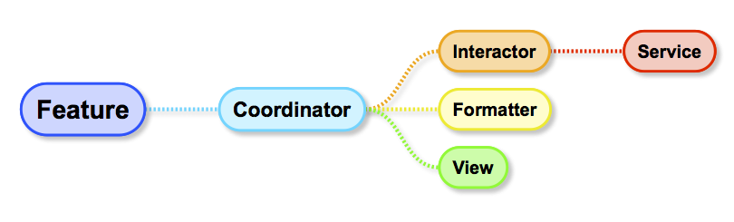

This workspace contains iOS apps demonstrating the Remix architecture.

## Primary goals

* Compositional reuse of views, business logic, and feature flows in many contexts
* Predictable behaviour with many loosely coordinated developers
* Fast, stable automated testing for almost everything

## Guiding principles

* Components are self-contained and don't know the context of how they're used (for remixability and predictability)
* Things that need to change together are in one place (for predictability)
* Protocols and dependency injection (for testability)
* Readable

## Elements of Remix

Remix is based around several concepts that work together. Communication between components is explicit (no magic), and generally follows the familiar delegate and completion block patterns.

* Feature
	- Factory for a coordinator
	- Bundles up dependencies for a coordinator
* Coordinator
	- Flow logic as a first-class citizen
	- Glue code for all other elements
	- changing a flow can be done in one place, rather than across many files
	- making a new flow with some of the same components is a matter of just creating a new coordinator
	- `start()` kicks it off
* Interactor
	- Use case/business logic
* Formatter
	- Presentation logic
	- Transforms Interactor results to ViewData
* ViewData
	- Simple view state struct
* View
	- Renders ViewData
	- Informs delegates (usually Coordinators) of events
* Service
	- Gateway to external system
* Entity
	- Application-independent model
* Factory
	- Abstracts creation
* Wireframe
	- Abstracts system view controllers
	- E.g., UINavigationController, UISplitViewController
* Component
	- An element used in multiple ways
	- E.g., a view or a flow that can be used by several coordinators
* "UI"-prefix denotes a UIKit-specific implementation of an element

## Sample apps

### Calculator

Simplest possible demonstration of Remix that includes all the major elements.

### GroupBrowser

Simple app that uses the `GroupSelectionFeature` as a browser hooked up to a generic `ItemDetailView` to display details of the group. Note the `GroupSelectionFeature` is a pod that is shared with other apps.

### Marketplace

A more complex app that lets users browse a collection of classified adverts, filter them by group, and create new adverts.

It remixes components in several ways:

* Two advert insertion flows share some of the same views, formatter and interactor but have different flows
* `AlternatingInsertionFeature` alternates between the two insertion flows when inserting a new advert (for A/B testing, for example)
* `AutoGroupInsertionFeature` has its own interactor that automatically selects a group for a new advert, but also reuses the `InsertionInteractor` from the `ManualGroupInsertionFeature` to actually publish it
* `TextEntryStepView` is used in both insertion flows
* `GroupSelectionFeature` is used both for selecting a group for filtering the list of adverts, and as a subflow of the `ManualGroupInsertionFeature` to select a group when inserting a new advert
* Generic `ItemDetailView` is used to display details about an advert
* Different flows for iPhone and iPad using all the same features

## Points of interest

* Features can be moved into their own pods for extra isolation and reuse
* Unit tests and acceptance tests don't depend on UIKit and run as very fast Mac logic tests without a simulator
* Dynamic frameworks can be statically relinked for fast launch time
